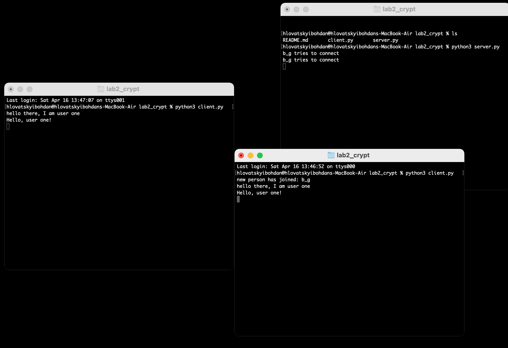

<<<<<<< HEAD
<<<<<<< HEAD
## Usage example

## Tasks
- RSA for digital signature 
- message integrity with hashes
- Encryption algo

## Theory: 
=======
## Usage example

## Tasks
- RSA for digital signature 
- message integrity with hashes
- Encryption algo

## Theory: 
>>>>>>> c012145ad177ce42daf1185111cf9bbd5a431fc7
- https://github.com/zademn/EverythingCrypto
=======
## Usage example

## Tasks
- RSA for digital signature 
- message integrity with hashes
- Encryption algo

## Theory: 
=======
## Usage example

## Tasks
- RSA for digital signature 
- message integrity with hashes
- Encryption algo

## Theory: 
- https://github.com/zademn/EverythingCrypto
>>>>>>> 84dffa399b4fda98060a34a44bc72a4de74fb4ef
